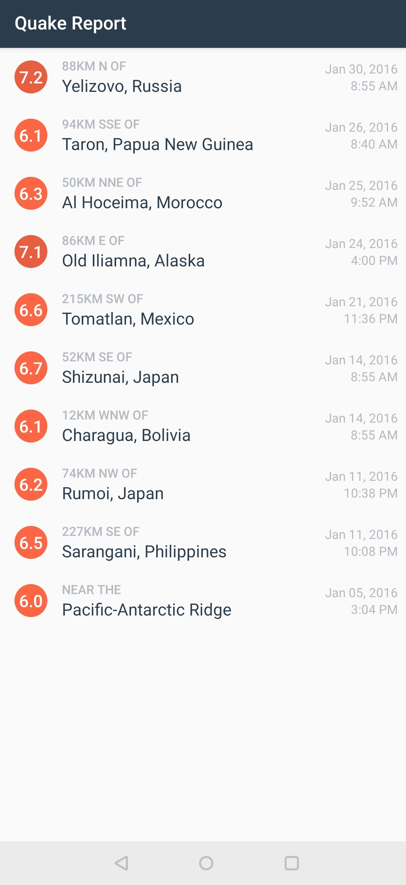

# earthqauke-report-

This app displays a list of recent earthquakes in the world from the U.S. Geological Survey (USGS) organization.

Used in a Udacity course in the Beginning Android Nanodegree.

More info on the USGS Earthquake API available at: https://earthquake.usgs.gov/fdsnws/event/1/

In this app we use linear layout to create catchy look with the help of custom adapter and also used circle shape xml first time...and display some of the last earthquakes..

